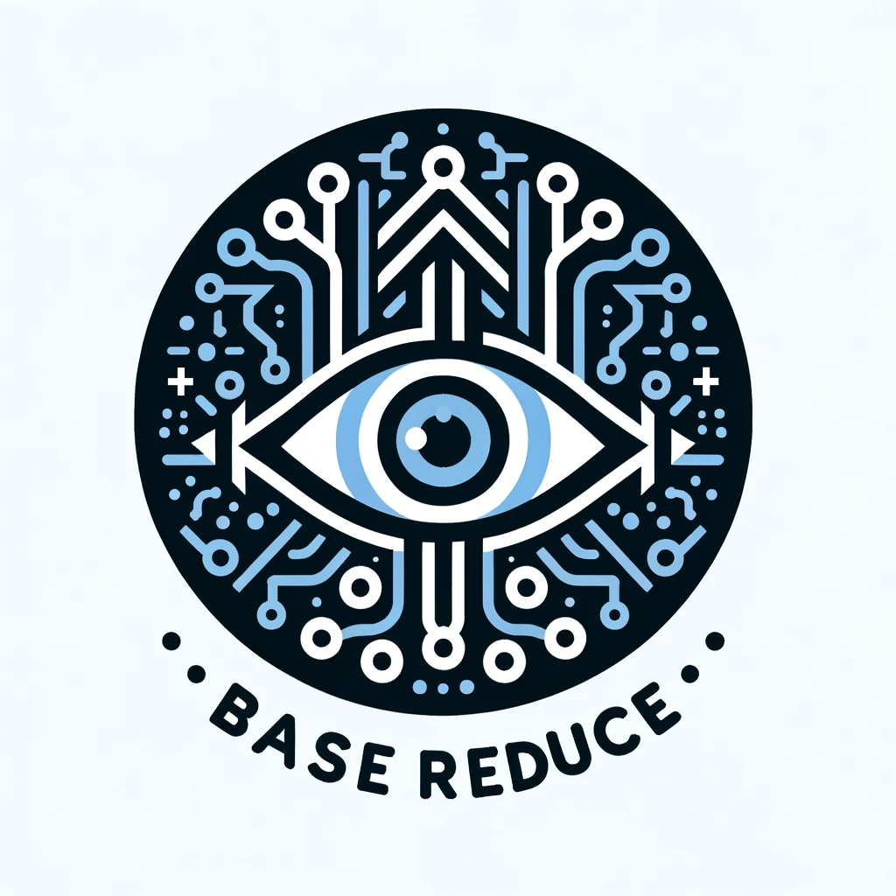

# BaseReduce

`basereduce` is a toolkit that allows you to train edge AI models, even if you don't have any data to start with! Here's what makes BaseReduce special:

- **Train Without Data**: You don't need a huge collection of images or data to train your AI. With BaseReduce, you can create a synthetic dataset from scratch using powerful AI that knows how to generate images.
  
- **Extract Knowledge from Base Computer Vision models**: There's a lot of knowledge locked away in big, pre-trained AI models. BaseReduce knows how to tap into these "Foundation models" and transfer their knowledge to your smaller model, making it wise beyond its size.

- **Small but Mighty Models**: Our goal is to help you create models that are small enough to fit into any device but still perform like the big ones in the special tasks they were trained for.

And why the name BaseReduce? It's simple:

- **Base**: We start with the basics, the "base" knowledge from large AI models.
- **Reduce**: We then "reduce" that knowledge into a smaller, more compact form that's easy to handle.

So, in a nutshell, BaseReduce helps you go from zero to AI hero, building intelligent models efficiently and effectively.

## Features

- **Prompt Generation**: Automate the creation of image prompts using powerful language models.
- **Image Generation**: Generate synthetic datasets with state-of-the-art generative models.
- **Dataset Annotation**: Leverage foundation models to automatically label datasets.
- **Edge Model Training**: Train efficient small-scale neural networks for edge deployment.

## Installation

To install `basereduce` from source, follow these steps:

```bash
# Clone the repository
git clone https://github.com/luxonis/basereduce.git
cd basereduce

# Install the package
pip install -e .
```

## Usage

## License

## Acknowledgements

This library was made possible by the use of several open-source projects, including Transformers, Diffusers, and others listed in the requirements.txt.
