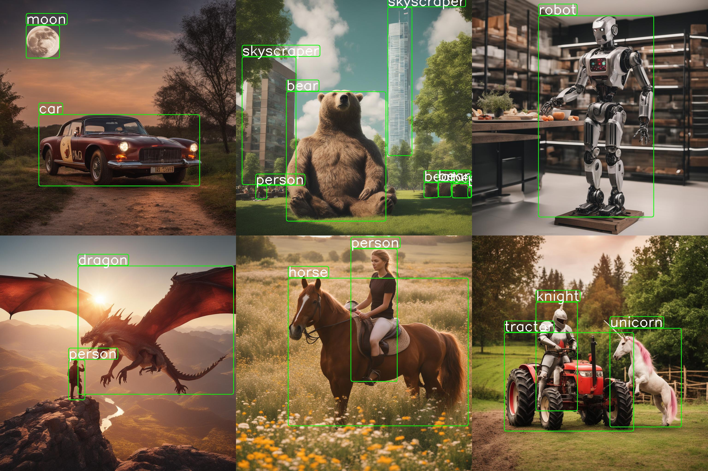
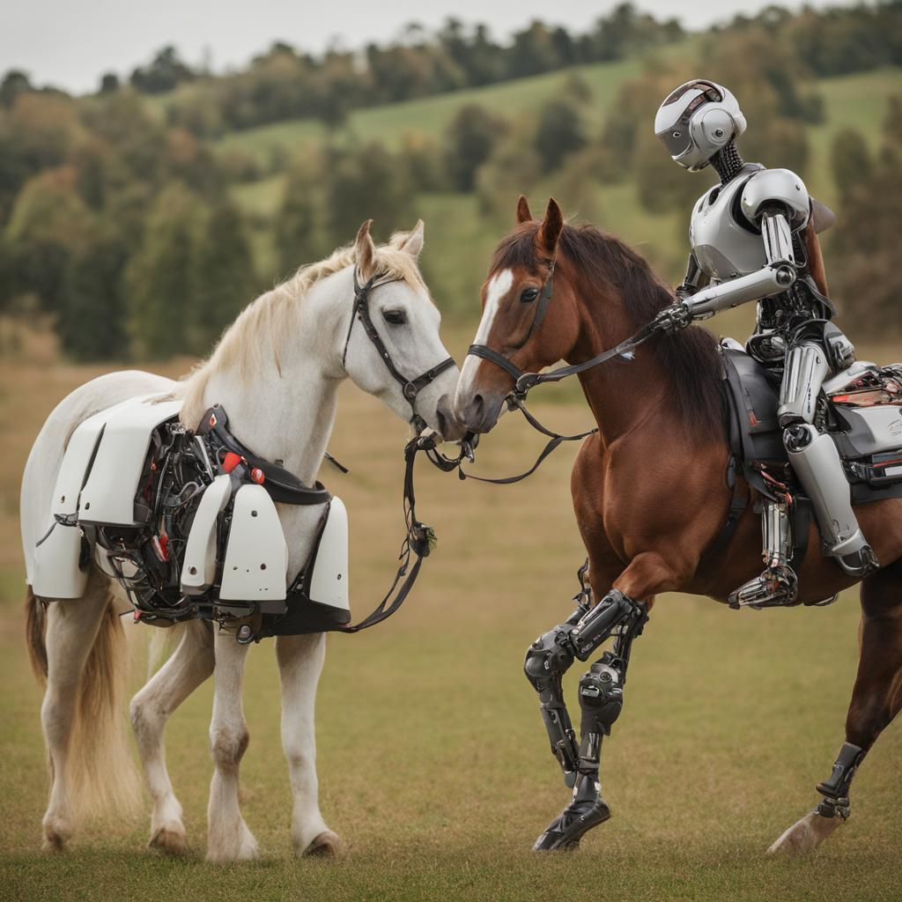
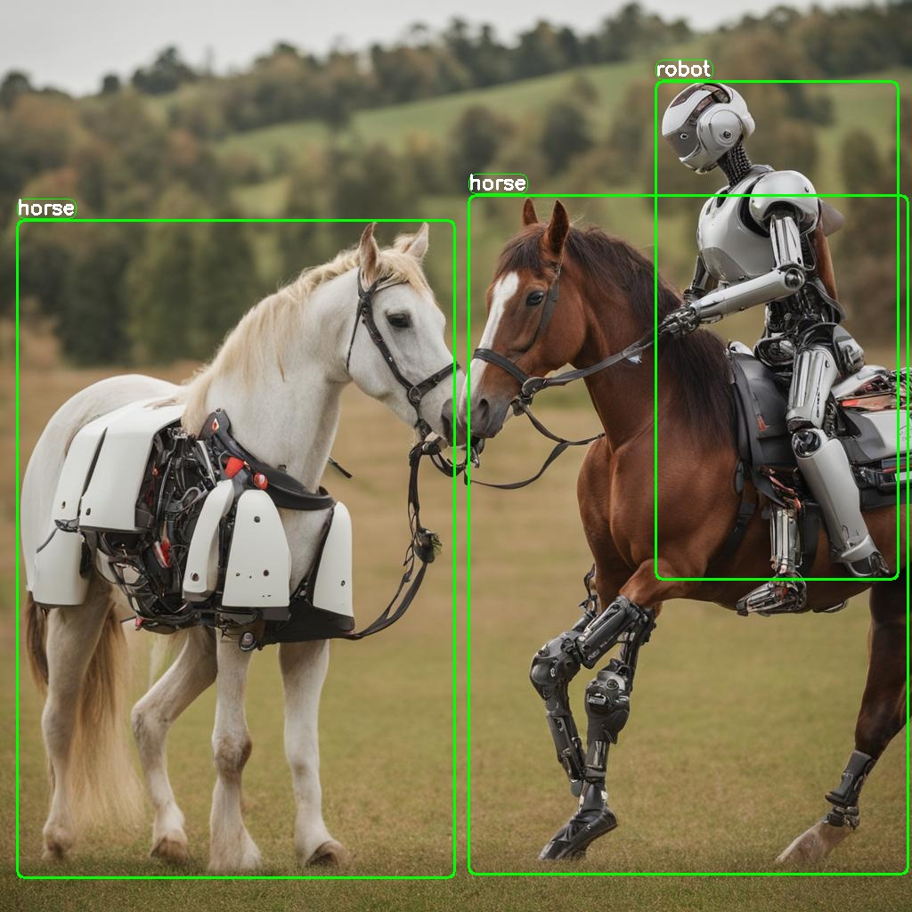

# DataDreamer

[](https://opensource.org/licenses/Apache-2.0)
[](https://colab.research.google.com/github/luxonis/datadreamer/blob/main/examples/generate_dataset_and_train_yolo.ipynb)



`DataDreamer` is an advanced toolkit engineered to facilitate the development of edge AI models, irrespective of initial data availability. Distinctive features of DataDreamer include:

- **Synthetic Data Generation**: Eliminate the dependency on extensive datasets for AI training. DataDreamer empowers users to generate synthetic datasets from the ground up, utilizing advanced AI algorithms capable of producing high-quality, diverse images.

- **Knowledge Extraction from Foundational Models**: `DataDreamer` leverages the latent knowledge embedded within sophisticated, pre-trained AI models. This capability allows for the transfer of expansive understanding from these "Foundation models" to smaller, custom-built models, enhancing their capabilities significantly.

- **Efficient and Potent Models**: The primary objective of `DataDreamer` is to enable the creation of compact models that are both size-efficient for integration into any device and robust in performance for specialized tasks.

The rationale behind the name `DataDreamer`:

- **Data**: Emphasizes the central role of data, either existing or synthetically generated, as the cornerstone of AI model training.
- **Dreamer**: Reflects the innovative and forward-thinking approach of creating something impactful from mere concepts or "dreams," symbolizing the transformation of abstract ideas into concrete, intelligent models.

In essence, `DataDreamer` is designed to transform the AI development process, making it more accessible, efficient, and effective, turning visionary ideas into reality.

## Table of Contents

- [Features](#features)
- [Installation](#installation)
- [Hardware Requirements](#hardware-requirements)
- [Usage](#usage)
  - [Main Parameters](#main-parameters)
  - [Additional Parameters](#additional-parameters)
  - [Available models](#available-models)
  - [Example](#example)
  - [Output](#output)
  - [Annotations Format](#annotations-format)
  - [Note](#note)
- [Limitations](#limitations)
- [License](#license)
- [Acknowledgements](#acknowledgements)

<a name="features"></a>

## Features

- **Prompt Generation**: Automate the creation of image prompts using powerful language models.

  *Provided class names: \["horse", "robot"\]* ->  *Generated prompt: "A photo of a horse and a robot coexisting peacefully in the midst of a serene pasture."*

- **Image Generation**: Generate synthetic datasets with state-of-the-art generative models.



- **Dataset Annotation**: Leverage foundation models to label datasets automatically.



- **Edge Model Training**: Train efficient small-scale neural networks for edge deployment. (not part of this library)

[Example](https://github.com/luxonis/datadreamer/blob/main/examples/generate_dataset_and_train_yolo.ipynb)

<a name="installation"></a>

## Installation

To install with pip:

```bash
pip install datadreamer
```

To install `datadreamer` from source, follow these steps:

```bash
# Clone the repository
git clone https://github.com/luxonis/datadreamer.git
cd datadreamer

# Install the package
pip install .
```

<a name="hardware-requirements"></a>

## Hardware Requirements

To ensure optimal performance and compatibility with the libraries used in this project, the following hardware specifications are recommended:

- `GPU`: A CUDA-compatible GPU with a minimum of 16 GB memory. This is essential for libraries like `torch`, `torchvision`, `transformers`, and `diffusers`, which leverage CUDA for accelerated computing in machine learning and image processing tasks.
- `RAM`: At least 16 GB of system RAM, although more (32 GB or above) is beneficial for handling large datasets and intensive computations.

<a name="usage"></a>

## Usage

The `datadreamer/pipelines/generate_dataset_from_scratch.py` (`datadreamer` command) script is a powerful tool for generating and annotating images with specific objects. It uses advanced models to both create images and accurately annotate them with bounding boxes for designated objects.

Run the following command in your terminal to use the script:

```bash
datadreamer --save_dir <directory> --class_names <objects> --prompts_number <number> [additional options]
```

<a name="main-parameters"></a>

### Main Parameters

- `--save_dir` (required): Path to the directory for saving generated images and annotations.
- `--class_names` (required): Space-separated list of object names for image generation and annotation. Example: person moon robot.
- `--prompts_number` (optional): Number of prompts to generate for each object. Defaults to 10.

<a name="additional-parameters"></a>

### Additional Parameters

- `--task`: Choose between `detection` and `classification`. Default is `detection`.
- `--num_objects_range`: Range of objects in a prompt. Default is 1 to 3.
- `--prompt_generator`: Choose between `simple` and `lm` (language model). Default is `simple`.
- `--image_generator`: Choose image generator, e.g., `sdxl` or `sdxl-turbo`. Default is `sdxl-turbo`.
- `--image_annotator`: Specify the image annotator, like `owlv2`. Default is `owlv2`.
- `--conf_threshold`: Confidence threshold for object detection. Default is 0.15.
- `--use_tta`: Toggle test time augmentation for object detection. Default is True.
- `--enhance_class_names`: Enhance class names with synonyms. Default is False.
- `--use_image_tester`: Use image tester for image generation. Default is False.
- `--image_tester_patience`: Patience level for image tester. Default is 1.
- `--device`: Choose between `cuda` and `cpu`. Default is cuda.
- `--seed`: Set a random seed for image and prompt generation. Default is 42.

<a name="available-models"></a>

### Available models

| Model Category    | Model Names                                                                           | Description/Notes                       |
| ----------------- | ------------------------------------------------------------------------------------- | --------------------------------------- |
| Prompt Generation | [Mistral-7B-Instruct-v0.1](https://huggingface.co/mistralai/Mistral-7B-Instruct-v0.1) | Semantically rich prompts               |
|                   | Simple random generator                                                               | Joins randomly chosen object names      |
| Image Generation  | [SDXL-1.0](https://huggingface.co/stabilityai/stable-diffusion-xl-base-1.0)           | Slow and accurate (1024x1024 images)    |
|                   | [SDXL-Turbo](https://huggingface.co/stabilityai/sdxl-turbo)                           | Fast and less accurate (512x512 images) |
| Image Annotation  | [OWLv2](https://huggingface.co/google/owlv2-large-patch14-ensemble)                   | Open-Vocabulary object detector         |

<a name="example"></a>

### Example

```bash
datadreamer --save_dir path/to/save_directory --class_names person moon robot --prompts_number 20 --prompt_generator simple --num_objects_range 2 4 --image_generator sdxl-turbo
```

This command generates images for the specified objects, saving them and their annotations in the given directory. The script allows customization of the generation process through various parameters, adapting to different needs and hardware configurations.

<a name="output"></a>

### Output

The dataset comprises two primary components: images and their corresponding annotations, stored as JSON files.

```bash

save_dir/
│
├── image_1.jpg
├── image_2.jpg
├── ...
├── image_n.jpg
├── prompts.json
└── annotations.json
```

<a name="annotations-format"></a>

### Annotations Format

1. Detection Annotations (detection_annotations.json):

- Each entry corresponds to an image and contains bounding boxes and labels for objects in the image.
- Format:

```bash
{
  "image_path": {
    "boxes": [[x_min, y_min, x_max, y_max], ...],
    "labels": [label_index, ...]
  },
  ...
  "class_names": ["class1", "class2", ...]
}
```

2. Classification Annotations (classification_annotations.json):

- Each entry corresponds to an image and contains labels for the image.
- Format:

```bash
{
  "image_path": {
    "labels": [label_index, ...]
  },
  ...
  "class_names": ["class1", "class2", ...]
}
```

<a name="note"></a>

### Note

Please make sure that all dependencies are correctly installed and that the datadreamer package is properly set up in your Python environment before running the script.

<a name="limitations"></a>

## Limitations

While the datadreamer library leverages advanced Generative models to synthesize datasets and Foundation models for annotation, there are inherent limitations to consider:

- `Incomplete Object Representation`: Occasionally, the generative models might not include all desired objects in the synthetic images. This could result from the complexity of the scene or limitations within the model's learned patterns.

- `Annotation Accuracy`: The annotations created by foundation computer vision models may not always be precise. These models strive for accuracy, but like all automated systems, they are not infallible and can sometimes produce erroneous or ambiguous labels.

Despite these limitations, the datasets created by datadreamer provide a valuable foundation for developing and training models, especially for edge computing scenarios where data availability is often a challenge. The synthetic and annotated data should be seen as a stepping stone, granting a significant head start in the model development process.

<a name="license"></a>

## License

This project is licensed under the [Apache License, Version 2.0](https://opensource.org/license/apache-2-0/) - see the [LICENSE](LICENSE) file for details.

The above license does not cover the models. Please see the license of each model in the table above.

<a name="acknowledgements"></a>

## Acknowledgements

This library was made possible by the use of several open-source projects, including Transformers, Diffusers, and others listed in the requirements.txt.

[SD-XL 1.0 License](https://github.com/Stability-AI/generative-models/blob/main/model_licenses/LICENSE-SDXL1.0)
[SDXL-Turbo License](https://github.com/Stability-AI/generative-models/blob/main/model_licenses/LICENSE-SDXL-Turbo)
